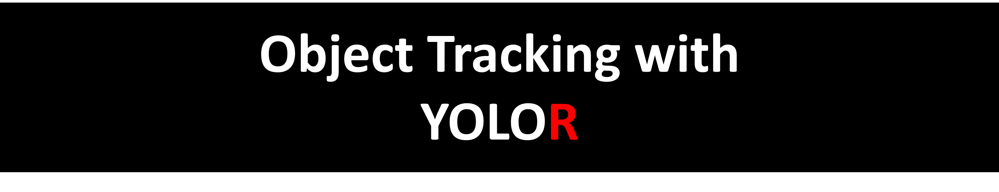

# Object Tracking with YOLOR  by João Ataíde

<p align="center">
  
</p>

This project was developed based on the practical knowledge gained from the [Augmented Startups](https://www.augmentedstartups.com/)  course. The course provided valuable insights and guidance on implementing advanced object tracking algorithms using deep learning technique. By applying the concepts learned from Augmented Startups, we were able to leverage the YOLOR algorithm and integrate it with the DeepSORT algorithm to create a robust and efficient object tracking system. The course materials and hands-on exercises from Augmented Startups played a significant role in shaping the development of this project, enabling us to deliver a high-quality and cutting-edge tracking solution.

<p align="center">
  
</p>

# Settings
* `Confidence:` Adjust the confidence level for object detection (range: 0.0 to 1.0).
* `Width:` Specify the desired width for the video (minimum: 300, maximum: 2000).
* `Save Image:` Enable this option to save the processed frames as images.
* `GPU:` Enable GPU acceleration for faster processing.
* `Night Demo:` Toggle between night and day mode for the demo video.
* `Use Custom Classes:` Enable this option to select custom classes for tracking.
* `Select The Custom Classes:` Choose the specific custom classes to track (if enabled).
* `Upload video:` Upload a video file for object tracking.

# Functionality
The dashboard performs the following tasks:

* Resizes the uploaded video to the specified width and automatically adjusts the height.
* Adds a logo to the sidebar.
* Displays the main title and sidebar title.
* Adjusts the sidebar width based on its expansion state.
* Provides sliders and input fields for various settings.
* Loads the demo video if no video is uploaded.
* Processes the video frames using the YOLOR algorithm and displays the processed frames in real-time.
* Shows key performance indicators (KPIs) such as frame rate, tracked objects, and width.
* Handles exceptions and ensures smooth execution.

# How to Run the Project

1. Install Python version 3.7 or above.
2. Clone the repository
   ```cmd
       git clone https://github.com/jvataidee/ObjectTrackingYOLOR.git
3. Install the required dependencies by running the following command:
   ```cmd
       pip install -r requirements.txt

4. Download the YOLOR weights and place them in the root folder.
   Weights link [`yolor_p6.pt`](https://drive.google.com/file/d/1rAgEQ6RV8H0cuUsyhadCn0tqU0u5KKy5)
5. Download the demo videos and place them in the `video_demos` folder: [Video Demos](https://drive.google.com/drive/folders/135DHbo0Ww76IjscqIo4r8lk1mUSusxtD)
6. Set the directory:
   ```cmd
      cd ObjectTrackingYOLOR

7. Run the dashboard:
   ``` cmd
       streamlit run streamlit_demo_base.py


# About YOLOR

YOLOR (You Only Look Once for Object Recognition) is an object detection algorithm based on the YOLO (You Only Look Once) architecture. It is implemented in the yolor library, which is available in this repository: https://github.com/WongKinYiu/yolor.

YOLOR is renowned for its efficiency and accuracy in object detection in images and videos. It performs detection and tracking in a single step, making it suitable for real-time applications. The algorithm utilizes a convolutional neural network (CNN) to extract features from images and generate bounding boxes with the detected object classes.

    @article{wang2021you,
      title={You Only Learn One Representation: Unified Network for Multiple Tasks},
      author={Wang, Chien-Yao and Yeh, I-Hau and Liao, Hong-Yuan Mark},
      journal={arXiv preprint arXiv:2105.04206},
      year={2021}
    }

# About DeepSORT

DeepSORT is a state-of-the-art deep learning-based algorithm for object tracking. It is implemented in the deep_sort library, which is available in this repository: https://github.com/nwojke/deep_sort.

DeepSORT combines the YOLO object detection algorithm with deep appearance feature embeddings and the Hungarian algorithm for data association. It performs multi-object tracking by associating detections across multiple frames, maintaining track identities, and handling occlusions and temporary disappearances.

    @inproceedings{Wojke2017simple,
      title={Simple Online and Realtime Tracking with a Deep Association Metric},
      author={Wojke, Nicolai and Bewley, Alex and Paulus, Dietrich},
      booktitle={2017 IEEE International Conference on Image Processing (ICIP)},
      year={2017},
      pages={3645--3649},
      organization={IEEE},
      doi={10.1109/ICIP.2017.8296962}
    }
    
    @inproceedings{Wojke2018deep,
      title={Deep Cosine Metric Learning for Person Re-identification},
      author={Wojke, Nicolai and Bewley, Alex},
      booktitle={2018 IEEE Winter Conference on Applications of Computer Vision (WACV)},
      year={2018},
      pages={748--756},
      organization={IEEE},
      doi={10.1109/WACV.2018.00087}
    }
